# Zit source control for Visual Studio Code

Work with [Zit](https://fossil.craftdesign.group/zit/home) repositories without leaving your editor. The extension brings Zit working-tree changes, history, comparisons, and repository operations into Visual Studio Code.

## Features

- Review tracked and untracked changes in the Source Control view, then add, forget, revert, clean, or commit without a staging area.
- Follow project or file history in the Zit Timeline, inspect changed files, compare refs in a multi-diff editor, and annotate committed lines with Praise.
- Initialize, clone, and open repositories; manage branches, symbolic tags, and stashes; and run pull, push, sync, and Git export workflows.
- Configure the Zit executable, automatic refresh, background sync, commit author, and command arguments for each environment.

## Feature tour

Once installed, the extension keeps everyday Zit work inside the editor while making each repository-changing action clear.

### Start and review

#### Create or open a repository

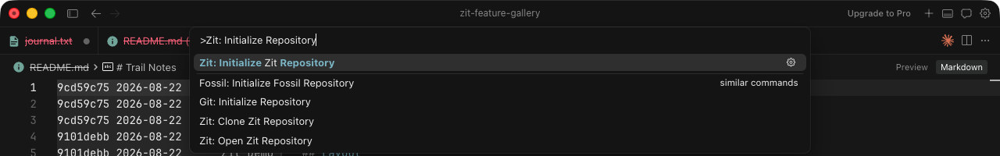

*Initialize, clone, or open a repository, then land in a checkout ready to work.*

#### See your working tree

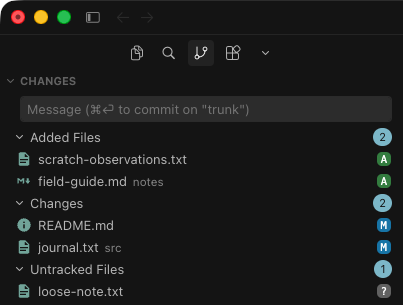

*Review tracked and untracked changes together, then inspect or act on the working tree without a staging step.*

### Understand the repository

#### Follow history

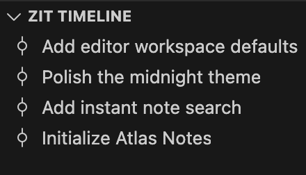

*Follow project history or the active file's history, then open a check-in to see what changed.*

#### Compare refs

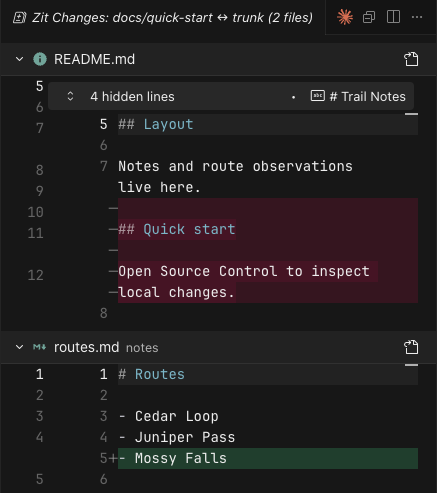

*Compare branches, symbolic tags, or check-ins in one multi-diff editor.*

#### Trace a line

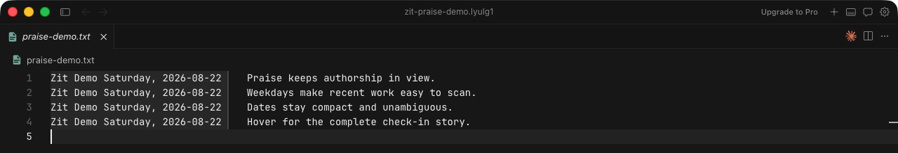

*Annotate committed lines with their author and weekday-aware date, with full check-in details on hover.*

### Shape your work

#### Move between branches

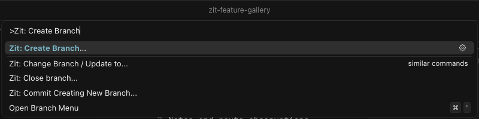

*Create a branch or switch the checkout to another branch from a focused picker.*

#### Mark or pause work

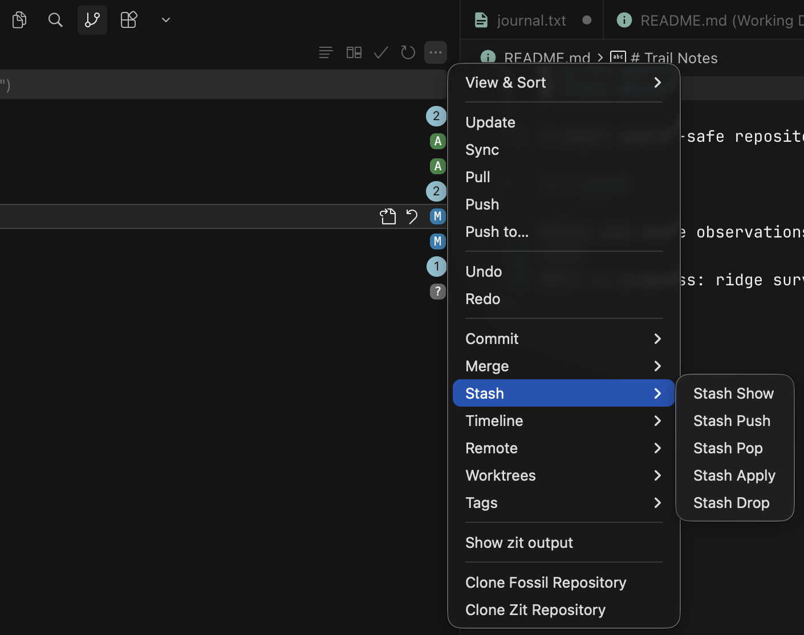

*Manage symbolic tags and stashes without leaving the editor; Stash Push is local, and apply is fail-closed.*

#### Merge a branch

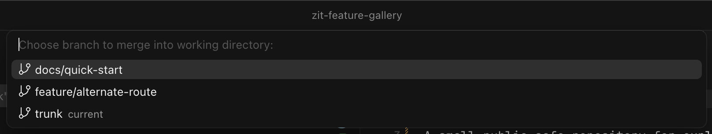

*Merge a branch into the working tree and get conflicts surfaced before you continue.*

#### Work across checkouts

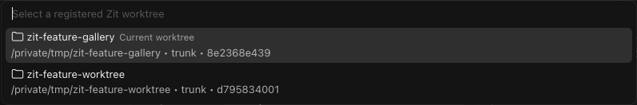

*List registered worktrees, open one in the current or a new window, or create another checkout.*

### Connect and hand off

#### Sync with a remote

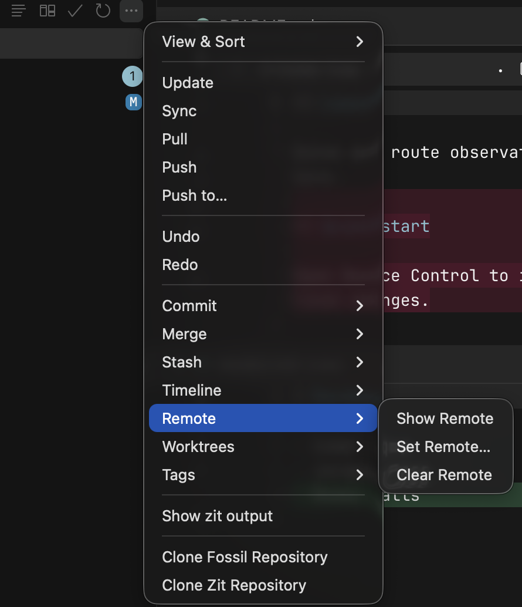

*Review or change the saved remote, then pull, push, or sync from the same focused flow.*

#### Export to Git

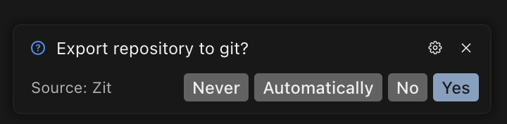

*Git export is explicit: choose whether it runs, then select the destination Git directory.*

## Installation

### Install Zit

Install a current `zit` executable and make it available on `PATH`, or set `zit.path` to its absolute path. Official binaries and source archives are available from the [Zit download page](https://fossil.craftdesign.group/zit/uv/download.html).

> **Supported Zit binaries:** Official prebuilt binaries are available for macOS ARM64, Linux x86-64, and Linux ARM64. There is currently no official Windows binary. The extension requires a working `zit` executable, whether installed from an official binary or built from source.

### Install the extension

When a release is listed in Open VSX, open your editor's Extensions view, search for `Zit` or the extension ID `danmestas.zit`, and select **Install**. A listing may not be available until the first public release is published.

To install a released VSIX manually, download `zit-<version>.vsix` from [GitHub Releases](https://github.com/danmestas/vscode-zit/releases), then run **Extensions: Install from VSIX...** from the Command Palette and select the downloaded file. From a terminal, Visual Studio Code users can instead run:

```sh
code --install-extension ./zit-<version>.vsix
```

### Checkout discovery

The extension discovers a checkout by walking upward from each workspace folder until it finds the regular `.zit-checkout` file. A checkout initialized in its own repository also has a `.zit` store; a detached worktree can use a store elsewhere and therefore has no local `.zit`.

## Workflows

Open the Command Palette and search for `Zit:` to see the commands available in the current context.

### Create or open a checkout

- **Zit: Initialize Repository** runs `zit init` in a selected directory.
- **Zit: Clone Repository** accepts the remote forms supported by Zit and opens the resulting checkout.
- **Zit: Open Repository** opens an existing Zit repository in a selected directory.
- Existing checkouts are discovered automatically when their folders are opened in VS Code.

### Work with changes

The Source Control view has three groups:

- **Added Files** — files already tracked by Zit and added since the current check-in.
- **Changes** — tracked files modified or removed in the working tree.
- **Untracked Files** — files not tracked by Zit.

Use the Source Control view or Command Palette to add files, forget files, inspect changes, revert changes, clean untracked files, and commit. Zit commits directly from the working tree: there is no staging area. A commit without selected paths records all tracked changes; resource commands can commit selected paths when the command supports it.

Cleaning untracked resources previews the paths first, then moves confirmed files and directories to the operating-system Trash. If the Trash operation fails, Zit reports the error and does not fall back to permanent deletion.

Use **Update** to move the checkout to another check-in, branch, or tag. Merge and cherry-pick actions operate on the working tree and report conflicts without inventing a persistent conflict status group.

### History and inspection

The Explorer includes a **Zit Timeline** view. It follows the active in-repository file, can switch back to project history, loads history in bounded pages, and keeps file scope while historical revisions are open. Select a file-history entry to compare that check-in with its parent; select a project-history entry to inspect the commit and its changed files. Use **Compare Refs...** from the Command Palette, the Source Control **Timeline** menu, or a timeline check-in's **Compare with...** action to compare any branch, symbolic tag, or check-in in one multi-diff editor.

Run **Zit: Praise** from the Command Palette to show each committed line’s author and weekday-aware date in the editor margin. Hover a line for the commit message and full metadata; run **Praise** again to hide the annotations.

### Branches, tags, stashes, and remotes

Supported workflows include:

- creating and switching branches;
- listing, adding, and canceling symbolic tags, including repository-wide and per-check-in tag views;
- saving, listing, applying, popping, and dropping stashes;
- pull, push, and sync;
- showing, setting, and clearing the repository's default remote;
- exporting the repository to Git.

Replacing or clearing the saved remote requires confirmation. Remote URLs are limited to HTTP or HTTPS and cannot include embedded credentials.

Private branches and mutating a checkout solely to close it are not exposed because Zit does not provide those operations.

## Deliberately unsupported surfaces

Zit has no staging area, so this extension has no stage, unstage, or “commit staged” commands. It also does not expose a web UI, patch commands, or wiki/technote creation and rendering. Collaboration artifacts may exist in the underlying Fossil-compatible protocol, but this extension does not interpret or edit them.

## Settings

- `zit.path` — absolute path to the `zit` executable. Leave empty to search `PATH`.
- `zit.autoRefresh` — refresh Source Control when workspace files change.
- `zit.autoSyncInterval` — seconds between background sync operations; `0` disables them.
- `zit.username` — author used for commits when an override is needed.
- `zit.defaultUsername` — fallback author used when Zit does not supply one.
- `zit.enableRenaming` — enable repository-aware rename actions.
- `zit.confirmGitExport` — whether to run Git export after commits: `Automatically`, `Ask`, or `Never`.
- `zit.globalArgs` — extra arguments passed to every Zit invocation.
- `zit.commitArgs` — extra arguments passed to `zit commit`.
- `zit.ignoreMissingZitWarning` — suppress the missing-executable warning.

Setting changes take effect without restarting VS Code unless VS Code marks the setting as machine-scoped.

## Troubleshooting

### Zit cannot be found

Run `zit version` in the integrated terminal. If it succeeds there, reload the window. Otherwise install Zit or set `zit.path` to the executable.

### A repository is not detected

Open a folder inside the checkout and confirm that `.zit-checkout` is a regular file in that folder or one of its parents. Initialized checkouts also have a local `.zit` store, while detached worktrees may not. Use **Zit: Open Repository** when you need to select a checkout explicitly.

### A command fails

Open **Zit: Show Output** to inspect the exact command, working directory, exit status, and diagnostic output. Credentials embedded in remote URLs are redacted from the output channel.

## Development

The source distribution includes detailed guides for building, testing, packaging, command behavior, releases, and Pikchr grammar development.

## Acknowledgements

This project began as a port of the vscode-fossil extension. Thanks to its contributors: [Ben Crowl](https://github.com/mrcrowl), [koog1000](https://github.com/koog1000), [senyai](https://github.com/senyai), [ajansveld](https://github.com/ajansveld), [hoffmael](https://github.com/hoffmael), [nioh-wiki](https://github.com/nioh-wiki), [joaomoreno](https://github.com/joaomoreno), and [nsgundy](https://github.com/nsgundy).
